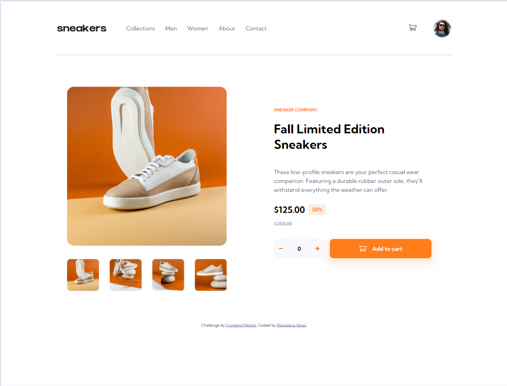
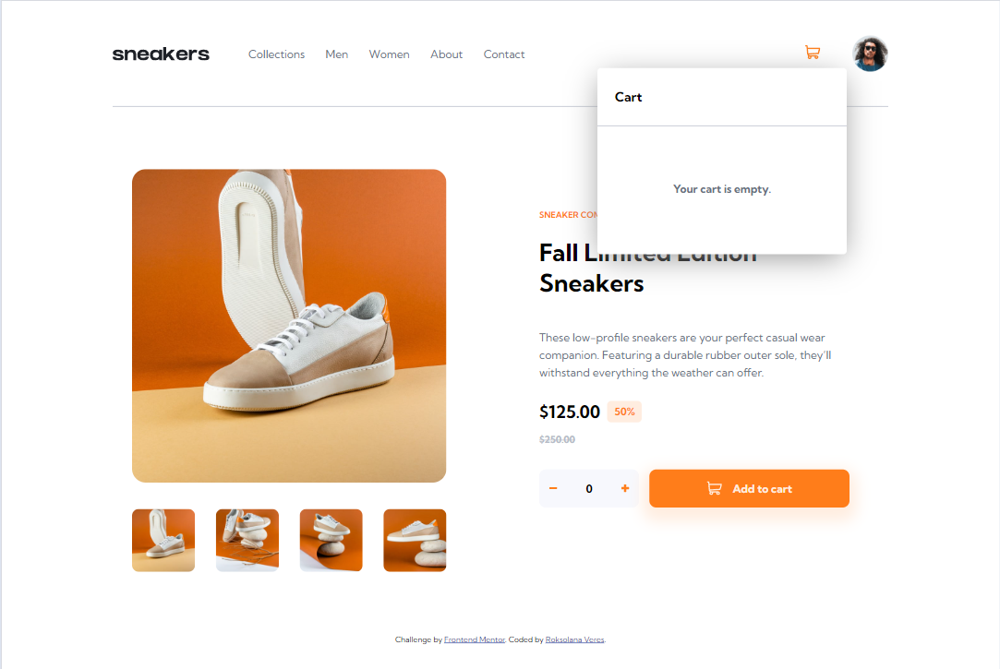
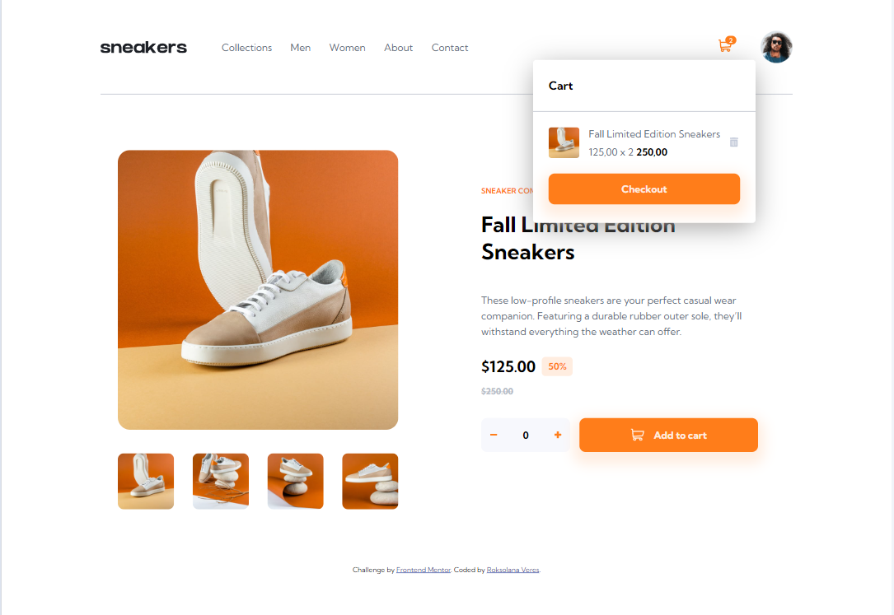
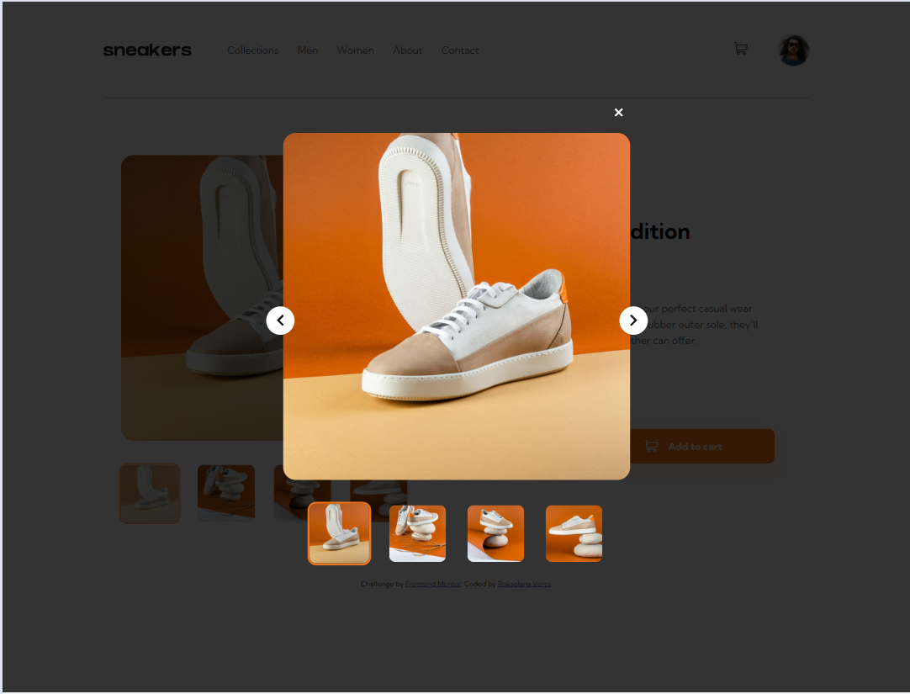
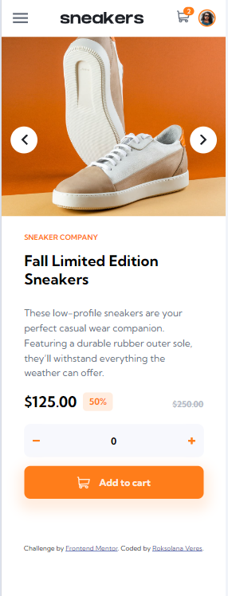
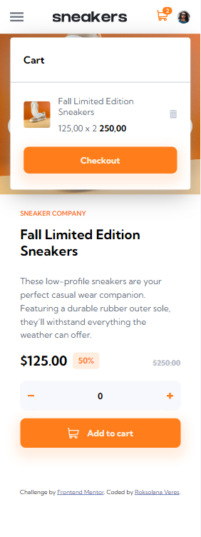
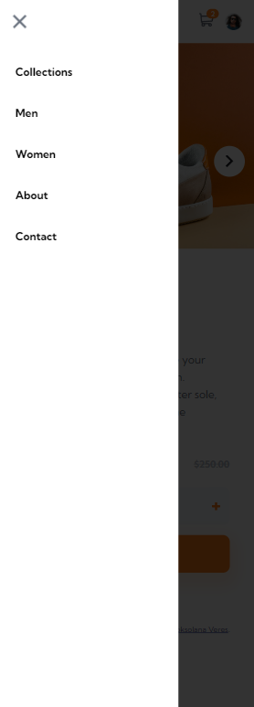

# Frontend Mentor - E-commerce product page solution

This is a solution to the [E-commerce product page challenge on Frontend Mentor](https://www.frontendmentor.io/challenges/ecommerce-product-page-UPsZ9MJp6). Frontend Mentor challenges help you improve your coding skills by building realistic projects.

## Table of contents

- [Overview](#overview)
  - [The challenge](#the-challenge)
  - [Screenshots](#screenshots)
  - [Links](#links)
- [My process](#my-process)
  - [Built with](#built-with)
- [Author](#author)

## Overview

### The challenge

Users should be able to:

- View the optimal layout for the site depending on their device's screen size
- See hover states for all interactive elements on the page
- Open a lightbox gallery by clicking on the large product image
- Switch the large product image by clicking on the small thumbnail images
- Add items to the cart
- View the cart and remove items from it

### Screenshots

### Links

- [Frontend Mentor solution](https://www.frontendmentor.io/solutions/advice-generator-app-using-fetch-0xl0lB37p_)
- [GitHub repo](https://github.com/RoksolanaVeres/Ecommerce-Product-Page)
- [Live Site](https://ecommerce-product-page-eight-blue.vercel.app/)

## My process

### Built with

- Semantic HTML5 markup
- BEM naming approach
- Flexbox
- Mobile-first workflow

## Author

- Frontend Mentor - [@RoksolanaVeres](https://www.frontendmentor.io/profile/RoksolanaVeres)
